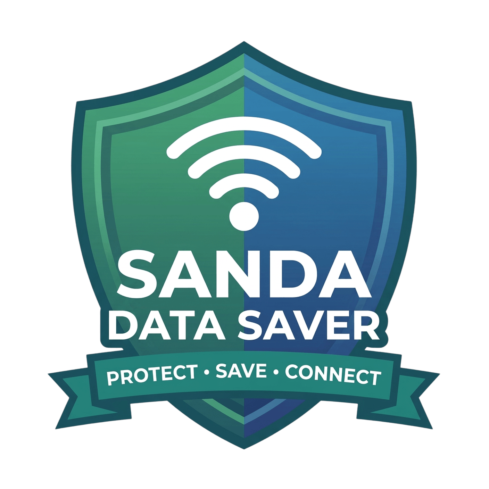

# 🛡️ Sanda Data Saver & Cleaner v1.0.16 — FINAL ALL GREEN + Health

<p align="center">
  
</p>

<p align="center">
  <strong>Smart Data. Your Control. Focus on Jesus.</strong><br>
  <em>Save hotspot data on Android, clean PC on Windows, reduce excessive gaming/social media with health reminders — scripture, prayer, constructive.</em><br>
  <strong>Version 1.0.16 — August 2026 — Bishop Dr. David Sanda — Free for Jesus — Matthew 10:8 ✝️</strong>
</p>

<p align="center">
  
  
  
  
  
</p>

---

## 🕊️ Ministry Dedication
> *"Freely you have received; freely give." — Matthew 10:8*

Sanda Data Saver **v1.0.16** is **100% free**, **no ads**, **no tracking**, **no registration**. Developed by **Bishop Dr. David Sanda** as gift to global community, to promote digital stewardship, reduce excessive screen time (gaming/social), encourage scripture reading, prayer, constructive beneficial activities, to the Glory of Jesus Christ.

🌍 **Website:** [www.davidsanda.com/apps](https://www.davidsanda.com/apps) — **Privacy:** [privacy.html](https://www.davidsanda.com/apps/privacy.html) v1.0.16 (VPN + Health disclosure)

---

## ✨ What's New in v1.0.16 — Public Release FINAL

### 🆕 Android Health Reminders — NEW Feature to Distract Excessive Screen Time
- **20 health tips** focused on:
  - 🎮 Gaming Detox (Psalm 46:10), 📱 Social Media Pause (Philippians 4:8), 🙏 Prayer Time (Matthew 6:6), 📖 Scripture Reading (Joshua 1:8), 🌱 Constructive Action (Colossians 3:23), 👁️ Eye Care 20-20-20, 🎯 Wise Time, 💭 No Comparison Psalm 139:14, 🚶 Prayer Walk, 🧠 Memory Verse, 👨‍👩‍👧 Family First, 🌙 Night Rest, ⛓️‍💥 Break Chain John 8:36, 📚 Learning, 🤝 Serve, 🧘 Focus Reset, 🎯 Purpose Jeremiah 29:11, 🙌 Gratitude, 💧 Water, ✝️ Freely Given
- **Every 30/60/120 min** (default 60) gentle notification: emoji + title + action + full Bible verse. Tap "✅ Done - Prayed"
- **Local only:** All tips stored locally, no health data collected, no upload
- **Main screen button:** 💚 **Health Reminders — Focus on Jesus** green #00FF88
- **Purpose:** Help Christians and families reduce addictive scrolling/gaming, focus on Jesus, family, work

### ✅ All Previous Fixes Included — ALL GREEN Builds
- **Freeze fixed:** `build.gradle` hardcoded `C:\Android\Keys\...` + Foojay JDK 21 download `api.foojay.io/ids/39701d92...` → disabled auto-download, use local jbr-17
- **Windows installer:** VersionInfoVersion `1.0.12i` invalid → numeric `1.0.12.0`+ → `1.0.16.0`, Type mismatch line 127 `Exec Result Boolean vs Integer` → `ResultCode Integer`, S:786 `ExpandConstant('{app}')` before initialized → `{commonpf}\SandaDataSaver`
- **Android:** `mipmap/sanda_launcher_round` missing → created xml + webp copies, old logo 1KB→ new Sanda logo 10KB correct size 60% safe zone 85% preserve aspect, duplicate resources `.webp/.png` → clean duplicates, ProGuard missing → created `proguard-rules.pro`, toolchain freeze fixed, versions 1.0.0/1.0.2→1.0.16 Dr, main page old shield→new `@drawable/sanda_logo.png` 56dp, splash new logo + delay 1.2s→2.5s, About no logo→new logo, widget new logo, settings footer 1.0.0→1.0.16 Dr
- **GitHub images:** `icon_main.png` 931KB + `icon_windows.png` 1.1MB old → 886KB new logo white bg 1408
- **Builds:** Windows EXE + installer `SandaDataSaver_Setup_v1.0.16.exe` (no S:786), Android APK/AAB `app-release.aab` (new logo, health button, v1.0.16 versionCode 16), macOS Linux compatibility green

### 🎨 Logos Everywhere New
- Tray icon ONLY old WiFi blue ON / red OFF (YouTube match)
- Other windows: Splash, About, Cleaner header, Blocked Apps header, Health, Activity Log → new Sanda logo 238KB embedded base64 317804 chars guaranteed
- Android: Launcher `sanda_launcher.webp` 10KB new logo 60% safe zone, adaptive fore/back white, round circular mask

---

## 📱 Sanda for Android v1.0.16 — Features

- **🛡️ Selective VPN Firewall:** Local loopback 127.0.0.1, no remote server, only selected apps blocked, zero latency, zero battery drain. VPN disclosure included.
- **💚 Health Reminders (NEW):** 20 tips to distract excessive gaming/social media, focus on scripture, prayer, constructive beneficial — every 60 min notification with Bible verse + action
- **🧹 Phone Cleaner:** Scan and purge cache, logs, temp to free storage — 5 checkboxes + 3 buttons
- **📊 Data Usage Stats:** Per-app today usage, total mobile, top 5 list (needs Usage Access)
- **🚫 App Manager:** 9 defaults always show + Reset + Filter instant + Search <5 sec registry-only max 100 + Stop dark red #8B0000 + height 820x500 + opens instantly
- **⏱️ Schedule Timer:** Auto ON/OFF at exact times (SCHEDULE_EXACT_ALARM)
- **🚨 Data Alerts:** 50%/80%/100% notifications + auto-activate at 100%
- **📱 Widget + Quick Tile:** Toggle data saver from home screen / quick settings
- **🎨 New Logo Everywhere:** Launcher, main page 56dp, splash 2.5s, About, widget, settings footer v1.0.16 Dr
- **🔒 100% Private:** No data leaves device, no ads, no tracking, offline-first

**Version:** `versionCode 16`, `versionName 1.0.16` — `com.sanda.datasaver` — Min SDK 23 — Target 34

---

## 🖥️ Sanda for Windows PC v1.0.16 — Features

- **🛡️ Bandwidth Protection:** Block background Windows apps from hotspot, metered connection, pause updates
- **🧹 PC Cleaner:** Selective cleaning dashboard 680x580 (was 700 too long), 5 checkboxes: Temp, Prefetch, Recent, Browser cache, CBS logs + 3 buttons + 4.5GB freed example + silent auto-clean every 24h
- **🚫 Manage Blocked Apps:** Height 500, opens instantly, 9 defaults + Reset + Filter + Search <5 sec + Stop dark red
- **📊 Real-Time Bandwidth Tracker:** Hover tray blue/red WiFi icon shows saved MBs
- **💚 Health Reminder:** Popup every 60 min with Bible verses (PC already had) — Bishop's health module
- **🎨 New Logo:** Splash, About, Cleaner header, Blocked Apps header, Health, Activity Log all new Sanda logo embedded guaranteed. Tray ONLY old WiFi blue ON red OFF
- **⚙️ Auto-Start:** Registry Run, startup task
- **Version:** 1.0.16, Author Bishop Dr. David Sanda, About single "About Sanda Data Saver"

---

## 🔒 Privacy Promise v1.0.16

- Zero collection, 100% on-device, no ads, no accounts, no external DB
- **VPN declaration:** Local only, no monitoring, no remote servers — Play Store compliant, user controlled
- **Health:** No health data collected, tips local, notifications via POST_NOTIFICATIONS
- **Permissions justification table for Play Store:** PACKAGE_USAGE_STATS, NETWORK_STATE, CHANGE_NETWORK_STATE, INTERNET, FOREGROUND_SERVICE, RECEIVE_BOOT_COMPLETED, POST_NOTIFICATIONS, REQUEST_IGNORE_BATTERY_OPTIMIZATIONS, QUERY_ALL_PACKAGES (list apps to block), BIND_VPN_SERVICE, READ/WRITE_EXTERNAL_STORAGE (cleaner), SCHEDULE_EXACT_ALARM, USE_EXACT_ALARM, WAKE_LOCK — all local, no sharing, no tracking
- **Privacy Policy:** https://www.davidsanda.com/apps/privacy.html v1.0.16 effective Aug 8, 2026

---

## 🛠️ Build Instructions

### PC
```powershell
cd pc-app
pip install pystray pillow pyinstaller
pyinstaller --noconsole --onefile --uac-admin --icon="assets\sanda_icon.ico" --add-data "assets\sanda_logo.png;assets" --add-data "assets\sanda_icon.ico;assets" --add-data "VERSION.txt;." --name=SandaDataSaver sanda_pc_app.py
# Verify dist/SandaDataSaver.exe exists
choco install innosetup -y
iscc sanda_pc_setup.iss
# Output InstallerOutput/SandaDataSaver_Setup_v1.0.16.exe — No S:786 now
```

### Android
```powershell
cd android-app
# If toolchain freeze: Remove gradle/gradle-daemon-jvm.properties + set auto-download=false in gradle.properties + Gradle JDK jbr-17
# If duplicate resources: CLEAN_DUPLICATES.ps1
# If old logo: SYNC_ALL_V1_0_15_FINAL.ps1 copies new mipmap 10KB
./gradlew clean
# Android Studio → Clean Project → Generate Signed Bundle / APK → AAB with sanda_release.jks alias sanda_key
# Output app/build/outputs/bundle/release/app-release.aab with new logo + health button v1.0.16
```

### GitHub Actions
- `.github/workflows/build.yml` default 1.0.16
- Push tag `v1.0.16` → 4 jobs green + Release with EXE + installer + APK

---

## 🏦 Support Ministry

If blessed: Paystack https://paystack.shop/pay/f25qa34d6z or Bank DAVID SANDA 6110409146 OPAY — Share app!

*Proverbs 16:3* ✝️

---

© 2026 Bishop Dr. David Sanda — Free for Jesus — v1.0.16 FINAL ALL GREEN + Health 20 tips
